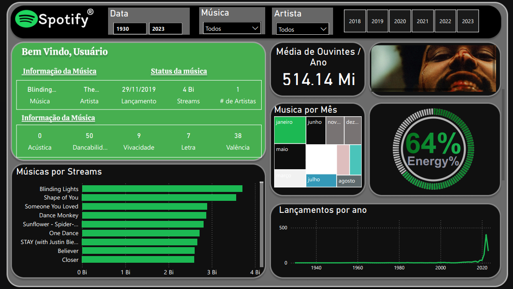

# Projeto: Dashboard Spotify - Análise de Tendências Musicais e Engajamento de Audiência

### ➡️ Análise Detalhada e Dashboard Interativo no Meu Portfólio:
[Acesse a página completa do projeto aqui](https://ferreiragabrielw.github.io/portfolio-gabriel/projetos/Dashboards/8DashboardSpotify/Projeto8DA.html)

---

## Sobre o Projeto

Este dashboard do **Spotify**, desenvolvido em **Power BI**, explora tendências musicais, engajamento da audiência e características de músicas populares. O projeto destaca a implementação de funcionalidades avançadas como a **integração com a Spotify API via Python** para enriquecimento de dados (capas de álbuns) e o uso de **visuais personalizados (Deneb e HTML Content)** para uma experiência imersiva e visualmente rica.

## Tecnologias e Processo

* **Ferramentas Principais**: Power BI Desktop (DAX, M), Figma (design).
* **Tecnologias Avançadas**: Python (para enriquecimento de dados), Spotify API (coleta de URLs de capas), HTML Visuals (renderização de capas), Deneb (gráficos personalizados Vega/Vega-Lite).
* **ETL**: Dataset do Kaggle enriquecido com script Python (API Spotify), transformações de data no Power Query e modelagem de dados no Power BI.
* **Insights Chave**: Média de ouvintes e total de streams, ranking de músicas/artistas, características sonoras (energia, dancabilidade), e padrões de lançamento ao longo do tempo.

## Conteúdo do Repositório

* `data/`: Base de dados original (`.xls`).
* `python/`: Script Python utilizado para interagir com a Spotify API e enriquecer o dataset.
* `quarto/`: Arquivo .qmd e sua versão HTML renderizada.
* `powerbi/`: Arquivo `.pbix` do dashboard Power BI.
* `figma/`: Arquivos relacionados ao protótipo e design no Figma.
* `html/`: Arquivo HTML utilizado para o visual HTML personalizado.
* `README.md`: Este documento.
* `LICENSE`: Licença do projeto (MIT License).

## Como Visualizar

* **Online**: [Acesse o dashboard publicado no Power BI Service](https://app.powerbi.com/groups/me/reports/76ca68bc-548e-4c6f-aad1-79c11ece500e/ReportSectionf29673a5990829443c5d?experience=power-bi)
* **Localmente**: Faça o download do arquivo `.pbix` na pasta `powerbi/` e abra-o com o Power BI Desktop. Note que para os visuais HTML de capas funcionarem localmente, o script Python para baixar as imagens pode precisar ser executado, e as configurações de segurança do Power BI Desktop para visuais personalizados podem precisar de ajuste.

---

### Licença

Este projeto está licenciado sob a [MIT License](LICENSE).
